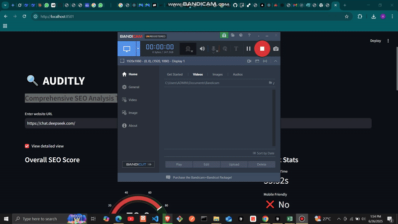

# Auditly 🔍



A comprehensive, instant SEO analysis platform that provides visual insights into website performance using free, open-source tools. No sign-up required!


## 🚀 Features

- **Instant Analysis**: Get immediate insights about your website's SEO performance
- **Visual Metrics**: Beautiful, animated charts and gauges to display SEO scores
- **Comprehensive Reports**: Detailed analysis across multiple SEO aspects:
  - Meta Tags & Headers
  - Content Quality
  - Technical SEO
  - Page Speed
  - Security
  - Link Structure
- **Smart Suggestions**: Actionable improvement recommendations for each category
- **Mobile-Friendly**: Responsive design works on all devices
- **No Sign-up Required**: Just enter your URL and get started
- **Dark Mode**: Modern, eye-friendly dark theme

## 🎯 Key Benefits

- Get instant SEO insights without expensive tools
- Identify SEO issues and opportunities quickly
- Track improvements over time
- Optimize content for better rankings
- Enhance technical SEO performance
- Improve user experience

## 🛠️ Technical Stack

- **Frontend**: Streamlit (Python-based web interface)
- **Analysis Engine**: Python with BeautifulSoup4, Trafilatura
- **Data Visualization**: Plotly
- **Security Analysis**: Python-whois
- **Performance**: Optimized for quick analysis

## 📊 What We Analyze

1. **Meta Tags**
   - Title tag optimization
   - Meta description
   - Open Graph tags
   - Robots meta
   - Canonical URLs

2. **Content Quality**
   - Heading structure
   - Content length
   - Keyword density
   - Image optimization
   - Alt text usage

3. **Technical SEO**
   - Server response
   - URL structure
   - Mobile responsiveness
   - Compression
   - Caching

4. **Speed Analysis**
   - Page load time
   - Resource sizes
   - Server response time

5. **Security**
   - SSL certification
   - Domain information
   - Security headers

6. **Link Analysis**
   - Internal links
   - External links
   - Broken links
   - NoFollow usage

## 🚀 Getting Started

1. Visit the live app at: [Auditly App](https://abdul-09-auditly-main-xyyw6v.streamlit.app/)
2. Enter your website URL (including http:// or https://)
3. Wait for the analysis to complete
4. Explore the detailed results across different categories
5. Review improvement suggestions

## 💻 Local Development

1. Clone the repository
```bash
git clone https://github.com/abdul-09/Auditly.git
cd seo-guru-main
```

2. Install dependencies
```bash
pip install -r requirements.txt
```

3. Run the app
```bash
streamlit run main.py
```

## 🌐 Deployment

The app is configured for easy deployment on Vercel:

1. Fork this repository
2. Connect your fork to Vercel
3. Deploy with zero configuration needed

The `vercel.json` file handles all the deployment configuration automatically.

## 📝 Future Features

- [ ] Detailed keyword analysis
- [ ] Competitor analysis
- [ ] PDF report generation
- [ ] Historical tracking

## 🤝 Contributing

Contributions are welcome! Please feel free to submit a Pull Request.

## 📄 License

This project is licensed under the MIT License - see the [LICENSE](LICENSE) file for details.

---
